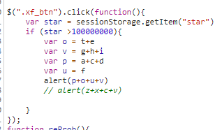
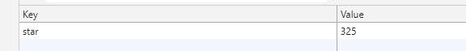
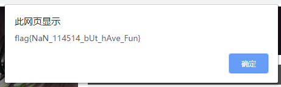

# 可恶的狗海豹

> Sajo姐姐最近迷上了《明日方舟》这款手游，她的目标是抽够100000000颗星的干员。

## WriteUp

根据题意我们要抽取共计100000000颗星星，那么我们就有以下两个思路：

- 按键精灵按一天
- 看一下怎么判断100000000颗星的然后拿flag

反正我选择第二个

我们先随便抽几发  (我选择抽到老陈为止

然后我们审计js 发现这里判断了是否大于100000000颗星

发现这里是使用了`sessionStorage`存储星星，然后打开`chrome`的`Application`，看`sessionStorage`，发现这里有个star的键值对

然后修改这个到999999999999999，再抽一发，得到flag

## flag
`flag{NaN_114514_bUt_hAve_Fun}`
